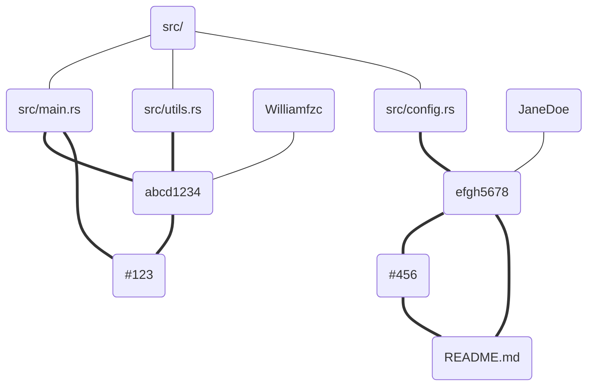
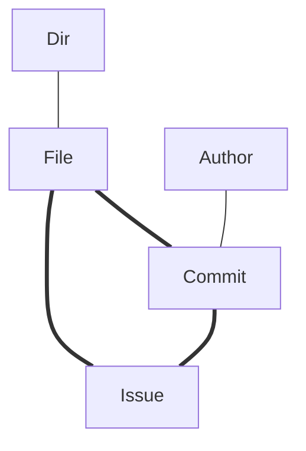

# cupido


> Explore your codebase with graph view.

## Goal & Motivation

It efficiently analyzes the entire commit history of a repository, combining information such as files, issue
references, authors, etc., to generate a graph for the entire repository, in seconds.

All analyses can be performed flexibly and quickly on the graph.



## Concept



Conceptually, the entire graph consists of three core node types:

- File Node: logic unit.
- Commit Node: developer unit.
- Issue Node: story unit.

These nodes are interconnected and support bidirectional fast searching.

In addition to these, there are also some additional nodes to support more extensive retrieval and analysis:

- Author Node
- Dir Node
- ...

## Usage

We primarily offer three usage modes:

- Rust library
- Local server mode (similar to LSP)
- CLI

### Rust library

See [examples/mini.rs](examples/mini.rs)

```rust
use cupido::collector::config::{get_collector, Collect, Config};

fn main() {
    let collector = get_collector();
    let mut conf = Config::default();
    conf.repo_path = String::from(".");
    let graph = collector.walk(Config::default());

    // 1. search from files to issues
    let file_name = String::from("src/server/app.rs");
    let issues = graph.file_related_issues(&file_name).unwrap();

    // src/server/app.rs related to ["#1"]
    println!("1. {} related to {:?}", file_name, issues);

    // 2. search from issues to commits
    let issue_label = issues.get(0).unwrap();
    let commits = graph.issue_related_commits(issue_label).unwrap();

    // #1 related to ["b7574411fbf685a777d1929bff26b3ad4ebd84f2"]
    println!("2. {} related to {:?}", issue_label, commits);

    // 3. search from commits to files
    let commit = commits.get(0).unwrap();
    let files = graph.commit_related_files(commit).unwrap();

    // b7574411fbf685a777d1929bff26b3ad4ebd84f2 related to ["src/server/mod.rs", "src/server/handler.rs", "src/server/config.rs", "src/server/app.rs", "src/server.rs", "src/main.rs"]
    println!("3. {} related to {:?}", commit, files);

    // Also, you can do it vice versa.
}
```

### Local server mode

You can find the corresponding binary files for your system on the release page:

https://github.com/williamfzc/cupido/releases/

You can start the service using the following command:

```shell
./cupido up --repo-path ~/workspace/github/axios
```

Upon successful startup, you should see logs similar to the following:

```text
2024-02-08T13:46:02.932406Z  INFO cupido: relation creating ...
2024-02-08T13:46:02.932754Z  INFO cupido: config: UpCommand { issue_regex: None, repo_path: Some("/Users/bytedance/workspace/github/axios"), path_specs: None, multi_parents: None }
2024-02-08T13:46:03.177632Z  INFO cupido: relation ready in 244.838094ms: GraphSize { file_size: 321, commit_size: 1136, issue_size: 753 }
2024-02-08T13:46:03.178575Z  INFO cupido: server up: http://127.0.0.1:9410
```

The service is exposed on port 9410, and you can access the HTTP API through it. You can use our client or other HTTP
tools to interact with it.

You can find our client and API documentation here: [node client](./client/node)

## Performance

cupido can also work with bare repo. At the most time, the analysis should finish in seconds.

| Repository                           | Time Taken   | File Size | Commit Size | Issue Size |
|--------------------------------------|--------------|-----------|-------------|------------|
| https://github.com/microsoft/pyright | 8.046621521s | 10486     | 6983        | 1403       |
| https://github.com/axios/axios       | 244.838094ms | 321       | 1136        | 753        |

## Contribution

Issues and PRs are always welcome. :)

Currently, we are working on API v1.

## License

[Apache 2.0](LICENSE)
